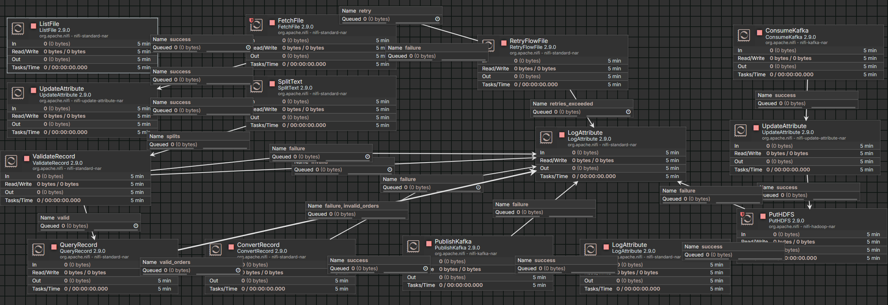
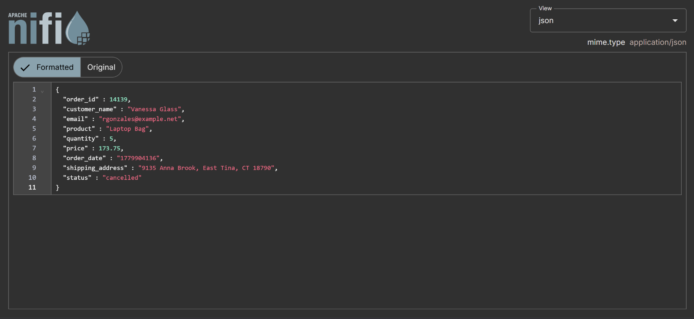
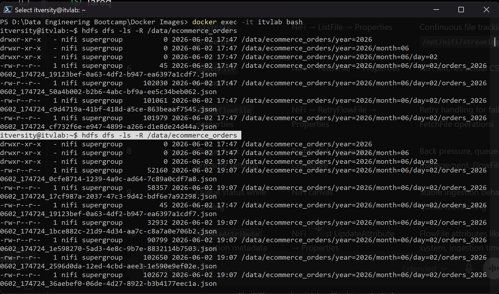
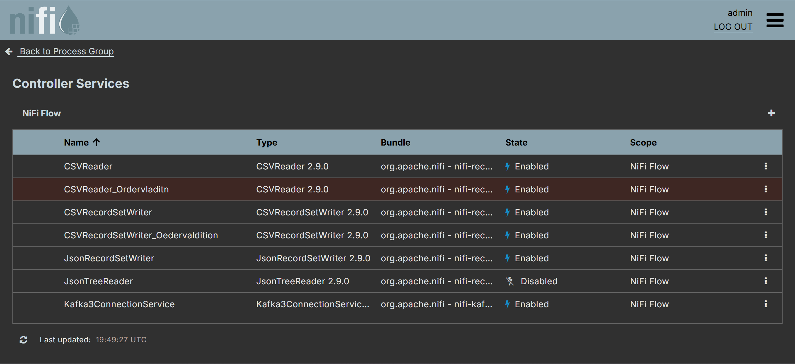

# Real-Time E-commerce Data Pipeline

**Business Scenario:** E-commerce Orders  
**Stack:** Python, Apache NiFi, Apache Kafka, Hadoop HDFS (all running in Docker)

---

## Pipeline Overview

The pipeline takes continuously generated CSV order files, ingests them through NiFi, validates and transforms them to JSON, pushes them through Kafka, and stores the final output in HDFS with date-based partitions.

```
Python Generator → CSV Files → NiFi Producer → Kafka → NiFi Consumer → HDFS
```

There are two separate NiFi flows. Kafka sits between them as the message broker.

### NiFi Flow Screenshot



---

## Data Flow

### Step 1 — Python Streaming Generator

A Python script using the Faker library continuously generates CSV files into a `streaming_data/` folder. Each file contains 5–2000 e-commerce order records with these columns:

```
order_id, customer_name, email, product, quantity, price, order_date, shipping_address, status
```

The generator intentionally produces messy data to test the pipeline:

| Data Problem | Example |
|---|---|
| Missing values | Fields replaced with `""`, `N/A`, `null`, `None` |
| Duplicate records | Same row written twice |
| Invalid records | Negative quantity, negative/zero price, future dates |
| Mixed timestamp formats | ISO, US, EU, Unix epoch, spelled-out months |
| Corrupted rows | Random garbage like `@#$`, `???`, `0x00` |
| Numeric inconsistencies | Quantity as `"two"`, price as `"free"` or `"$25"` |
| Bad emails | `user@@domain`, `@no_user.com`, spaces in email |

Output files are named like `orders_20260602_174724_1.csv`. The folder is mounted into the NiFi Docker container at `/opt/nifi/streaming_data`.

### Step 2 — NiFi Producer Flow

**ListFile** monitors `/opt/nifi/streaming_data` every 1 second for new `.csv` files. It uses tracking timestamps so it never re-reads old files. Minimum file age is set to 3 seconds to avoid reading files that are still being written.

**FetchFile** reads the actual CSV content into FlowFiles. If it fails, **RetryFlowFile** retries up to 3 times before routing to the failure log.

**UpdateAttribute** adds metadata to each FlowFile:

```
source_system = python_streaming_generator
business_case = ecommerce_orders
ingestion_time = ${now():format("yyyy-MM-dd HH:mm:ss")}
original_filename = ${filename}
```

**SplitText** chunks files at a maximum of 64 KB per fragment. It keeps the CSV header row on each chunk so downstream processors can still parse them.

**ValidateRecord** checks schema-level correctness — right number of columns, correct data types (order_id must be int, price must be double, etc). Records that fail schema validation get routed to the failure log.

**QueryRecord** applies business rules on top of schema validation using SQL:

```sql
SELECT * FROM FLOWFILE
WHERE order_id IS NOT NULL
AND customer_name IS NOT NULL AND customer_name NOT IN ('N/A','null','None')
AND email LIKE '%@%.%' AND email NOT LIKE '%@@%' AND email NOT LIKE '% %'
AND quantity > 0
AND price > 0
AND status IN ('pending','shipped','delivered','cancelled','processing','returned')
```

Records that fail these rules go to a separate failure log. This is needed because ValidateRecord alone would accept things like `quantity = -3` since it is still technically an integer.

**ConvertRecord** converts the surviving valid CSV records into JSON (one JSON object per line).

**PublishKafka** sends the JSON to the Kafka topic.

### Step 3 — Kafka Configuration

**Topic creation** (run inside the Kafka container):

```bash
/opt/kafka/bin/kafka-topics.sh --create \
  --topic ecommerce_orders_json \
  --bootstrap-server localhost:29092 \
  --partitions 3 \
  --replication-factor 1
```

**Topic verification:**

```bash
/opt/kafka/bin/kafka-topics.sh --describe \
  --topic ecommerce_orders_json \
  --bootstrap-server localhost:29092
```

```
Topic: ecommerce_orders_json    PartitionCount: 3    ReplicationFactor: 1
```

3 partitions allow parallel message distribution. Replication factor is 1 because the lab has a single Kafka broker.

**Kafka3ConnectionService** (NiFi controller service):

| Setting | Value |
|---|---|
| Bootstrap Servers | `kafka:29092` |
| Security Protocol | PLAINTEXT |

NiFi uses `kafka:29092` (Docker hostname) instead of `localhost:29092` because localhost inside NiFi points to its own container.

**PublishKafka** (NiFi producer processor):

| Setting | Value |
|---|---|
| Kafka Connection Service | Kafka3ConnectionService |
| Topic Name | `ecommerce_orders_json` |
| Failure Strategy | Route to Failure |
| Delivery Guarantee | Guarantee Replicated Delivery |
| Partitioner Class | DefaultPartitioner |

**ConsumeKafka** (NiFi consumer processor):

| Setting | Value |
|---|---|
| Kafka Connection Service | Kafka3ConnectionService |
| Group ID | `nifi-hdfs-consumer` |
| Topics | `ecommerce_orders_json` |
| Auto Offset Reset | earliest |
| Commit Offsets | true |
| Processing Strategy | FLOW_FILE |

FLOW_FILE strategy is used because the Kafka messages are already JSON, so NiFi consumes them directly as FlowFile content without needing a record reader.

**Console consumer test** (to verify messages are arriving):

```bash
/opt/kafka/bin/kafka-console-consumer.sh \
  --topic ecommerce_orders_json \
  --from-beginning \
  --bootstrap-server localhost:29092
```



### Step 4 — NiFi Consumer + HDFS

**ConsumeKafka** reads JSON messages from the topic (config shown above).

**UpdateAttribute** builds the date-partitioned HDFS path and a unique filename:

```
hdfs_output_dir = /data/ecommerce_orders/year=${now():format("yyyy")}/month=${now():format("MM")}/day=${now():format("dd")}
filename = orders_${now():format("yyyyMMdd_HHmmss")}_${uuid}.json
```

**PutHDFS** writes the JSON files to `hdfs://itvlab:9000` using the Hadoop config files (`core-site.xml`, `hdfs-site.xml`) mounted into NiFi.

### HDFS Final Output



---

## Controller Services

The pipeline uses these NiFi controller services:

| Service | Purpose |
|---|---|
| CSVReader | Reads CSV with Avro schema, treats first line as header |
| CSVRecordSetWriter | Writes valid records back as CSV (used by ValidateRecord and QueryRecord) |
| JsonRecordSetWriter | Writes records as JSON, one line per object |
| Kafka3ConnectionService | Connects to `kafka:29092` with PLAINTEXT security |

### Controller Services Screenshot



The Avro schema used by the CSVReader:

```json
{
  "type": "record",
  "name": "EcommerceOrder",
  "fields": [
    {"name": "order_id", "type": "int"},
    {"name": "customer_name", "type": "string"},
    {"name": "email", "type": "string"},
    {"name": "product", "type": "string"},
    {"name": "quantity", "type": "int"},
    {"name": "price", "type": "double"},
    {"name": "order_date", "type": "string"},
    {"name": "shipping_address", "type": "string"},
    {"name": "status", "type": "string"}
  ]
}
```

`order_date` is kept as string because the generator creates multiple timestamp formats. Forcing a single date type would reject otherwise valid records.

---

## Transformation Logic

Transformation happens in two stages:

**Stage 1 — Schema validation (ValidateRecord):** Catches structural problems like wrong column count, non-integer order_id, strings in numeric fields (`quantity = "two"`), and fully corrupted garbage rows.

**Stage 2 — Business rule validation (QueryRecord):** Catches logically invalid data that passes schema checks. For example, `quantity = -3` is a valid integer but not a valid order. The SQL query checks for null/placeholder values, positive quantity and price, valid email format, and allowed status values.

Records that pass both stages go to **ConvertRecord** which outputs JSON like:

```json
{"order_id":14139,"customer_name":"Vanessa Glass","email":"rgonzales@example.net","product":"Laptop Bag","quantity":5,"price":173.75,"order_date":"1779904136","shipping_address":"9135 Anna Brook, East Tina, CT 18790","status":"cancelled"}
```

---

## Error Handling

Every processor in the pipeline has its failure relationship routed to a **LogAttribute** processor that logs the failed FlowFile attributes for debugging.

| Processor | Failure Goes To |
|---|---|
| FetchFile | RetryFlowFile (3 retries) → then failure log |
| SplitText | Failure log |
| ValidateRecord | Invalid + failure → failure log |
| QueryRecord | invalid_orders + failure → failure log |
| ConvertRecord | Failure log |
| PublishKafka | Failure log |
| PutHDFS | Failure log |

Additional reliability mechanisms:
- **Back pressure:** Queues are limited to 1000 FlowFiles / 10 MB to prevent buildup
- **Yield duration:** Processors pause briefly after errors to avoid aggressive retry loops
- **Penalization:** Failed FlowFiles wait 30 seconds before retry
- **Provenance:** NiFi tracks every FlowFile event so any record can be traced from ingestion to HDFS

---

## Partitioning Strategy

HDFS output is partitioned by processing date using NiFi Expression Language:

```
/data/ecommerce_orders/year=YYYY/month=MM/day=DD/
```

Each file gets a UUID in its name to avoid collisions:

```
orders_20260602_174724_19123bef-0a63-4df2-b947-ea6397a1cdf7.json
```

Processing date (`now()`) was used instead of the order's `order_date` because the generator creates timestamps in multiple formats (ISO, Unix, US, EU). Parsing all of them for partitioning would add unnecessary complexity. Using processing date keeps partitioning simple and reliable.

Kafka topic is also partitioned with 3 partitions using the default partitioner, which distributes messages across partitions for parallel consumption.

---

## Challenges Faced

**1. HDFS not reachable from NiFi container**

HDFS was configured to listen on `localhost:9000` inside the `itvlab` container. From NiFi's perspective, `localhost` means its own container, not `itvlab`. I had to change `core-site.xml` to use `hdfs://itvlab:9000` and add `dfs.namenode.rpc-bind-host = 0.0.0.0` in `hdfs-site.xml` so HDFS accepts connections from other containers. Then I had to copy the Hadoop config files and mount them into the NiFi container for PutHDFS to work.

**2. Schema validation was not enough to catch bad data**

ValidateRecord only checks types. A record with `quantity = -5` passes because -5 is a valid integer. I had to add QueryRecord with SQL business rules to catch these kinds of logically invalid records. This two-layer approach (schema + business rules) ended up catching significantly more bad data.

**3. Docker networking between NiFi and Kafka**

NiFi cannot use `localhost:9092` to reach Kafka because that would point to itself. I had to use the Docker service name `kafka:29092` which is the internal listener configured for inter-container communication.

**4. SplitText breaking CSV parsing downstream**

When SplitText splits a file into chunks, the header row only exists in the first chunk. Without setting `Header Line Count = 1`, downstream CSV readers would fail on chunks 2, 3, etc. because they would try to parse data rows as headers.

---

## Conclusion

The pipeline works end-to-end: Python generates messy CSV files, NiFi picks them up, chunks them, validates them at both schema and business-rule levels, transforms valid records to JSON, publishes to Kafka, consumes from Kafka, and writes to HDFS in date-partitioned folders. Invalid and failed records are separated and logged at every stage.
