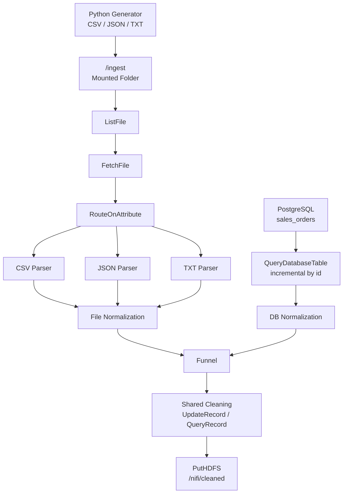

# Apache NiFi Real-Time Data Pipeline

A data ingestion and processing pipeline built with Apache NiFi. The pipeline ingests real-time generated files and PostgreSQL records, normalizes both into a shared schema, cleans them through a single transformation layer, and loads the output into HDFS.

## Technologies

| Tool | Purpose |
|---|---|
| Apache NiFi 2.9.0 | Data flow orchestration |
| Docker | Container environment |
| Python 3 | Real-time data generation |
| PostgreSQL 13 | Relational data source |
| HDFS (Hadoop) | Final storage layer |

## Architecture



Both sources are normalized into the same schema first, combined into one stream, then pass through a single shared cleaning layer before writing to HDFS.

---

## Setup

### NiFi

```powershell
docker run -d --name nifi `
  -p 8443:8443 `
  -e SINGLE_USER_CREDENTIALS_USERNAME=admin `
  -e SINGLE_USER_CREDENTIALS_PASSWORD=<your_password> `
  -v "D:\Data Engineering Bootcamp\Data\nifi_data:/ingest" `
  apache/nifi:latest
```

UI: `https://localhost:8443/nifi`

### PostgreSQL

```powershell
docker run -d --name postgres `
  -e POSTGRES_USER=admin `
  -e POSTGRES_PASSWORD=admin `
  -e POSTGRES_DB=nifidb `
  -p 5432:5432 `
  postgres:13
```

### HDFS

```powershell
docker exec -it itvlab hdfs dfs -mkdir -p /nifi/cleaned
docker exec -it itvlab hdfs dfs -chmod -R 777 /nifi
```

---

## Data Sources

### 1. File-Based Source (Python Generator)

The script `generate_data.py` runs continuously and writes files to the mounted `/ingest` directory every 3–7 seconds in CSV, JSON, or TXT format.

The data is intentionally messy:

| Issue | Examples |
|---|---|
| Missing fields | empty name, city, or price |
| Invalid age | `N/A`, empty, `None` |
| Inconsistent casing | `sanaa` / `SANAA` / `Sanaa` |
| Mixed timestamps | `2026-05-22 00:49:53`, `22/05/2026`, `05-22-2026 00:49` |
| Duplicates | repeated rows within a batch |

### 2. PostgreSQL Source

A `sales_orders` table with similar quality issues (mixed casing, nulls, empty names):

```sql
CREATE TABLE sales_orders (
    id SERIAL PRIMARY KEY,
    customer_name VARCHAR(100),
    city VARCHAR(100),
    product VARCHAR(100),
    quantity INT,
    price NUMERIC(10,2),
    order_status VARCHAR(50),
    created_at TIMESTAMP DEFAULT CURRENT_TIMESTAMP
);
```

---

## Pipeline Design

### File Ingestion

Uses the required `ListFile → FetchFile` pattern:

| Property | Value | Why |
|---|---|---|
| Input Directory | `/ingest` | Mounted volume from host |
| File Filter | `.*\.(csv\|json\|txt)` | Only supported formats |
| Minimum File Age | 10 sec | Avoid reading while Python is still writing |
| Completion Strategy | None | Keep originals for safe testing |

After `FetchFile`, `RouteOnAttribute` splits by extension:

```
is_csv  = ${filename:endsWith('.csv')}
is_json = ${filename:endsWith('.json')}
is_txt  = ${filename:endsWith('.txt')}
```

Each branch parses its format then feeds into the normalization layer.

### Database Ingestion

`QueryDatabaseTable` connects via `DBCPConnectionPool` with the PostgreSQL JDBC driver.

| Property | Value |
|---|---|
| Table Name | `sales_orders` |
| Maximum-value Columns | `id` |

Using `id` as the max-value column makes ingestion incremental — NiFi only reads new rows on each run.

### Normalization

Both sources have different schemas, so they are normalized into a common structure before merging:

| Field | File Source | DB Source |
|---|---|---|
| source_type | `file` | `database` |
| record_id | filename | id |
| customer_name | name | customer_name |
| age | age | null |
| city | city | city |
| product | product | product |
| quantity | quantity | quantity |
| price | price | price |
| status | null | order_status |
| event_time | timestamp | created_at |
| total_amount | price × quantity | price × quantity |

After normalization, both streams merge through a funnel so all records share the same columns before cleaning.

### Shared Cleaning Layer

One cleaning layer handles everything — no duplicated logic:

- **Casing**: `sanaa` → `Sanaa`, `laptop` → `Laptop`, `Completed` → `completed`
- **Missing values**: `N/A`, empty, `None` → null
- **Enrichment**: `total_amount = price × quantity`
- **Filtering**: drop records missing `customer_name`, `price`, or `quantity`
- **Deduplication**: remove repeated records

### HDFS Output

Cleaned data is written using `PutHDFS` to `/nifi/cleaned`.

---

## Sample Data

### Raw Input

**CSV:**
```csv
name,age,city,product,price,quantity,timestamp
Dana,30,,Phone,127.28,5,2026-05-22 00:49:53
Ahmad,N/A,,phone,470.99,8,2026-05-22 00:49:53
Hana,42,taiz,Headphones,40.02,8,05-22-2026 00:49
```

**JSON:**
```json
[
  {"name":"Noor","age":18,"city":"Taiz","product":"Laptop","price":303.23,"quantity":8,"timestamp":"22/05/2026"},
  {"name":"Khaled","age":"N/A","city":"SANAA","product":"tablet","price":134.26,"quantity":1,"timestamp":"22/05/2026"}
]
```

**TXT (pipe-delimited):**
```
Khaled|64|Mukalla|tablet|379.17|3|22/05/2026
Tareq|N/A|Aden|tablet|66.05|9|22/05/2026
Omar||taiz|tablet|231.93|5|05-22-2026 00:49
```

**PostgreSQL:**
```
id | customer_name | city  | product    | quantity | price  | order_status | created_at
---+---------------+-------+------------+----------+--------+--------------+---------------------
1  | Ahmad         | sanaa | laptop     | 2        | 450.50 | completed    | 2026-05-22 12:53:33
2  | Sara          | SANAA | Phone      | 1        | 300.00 | Completed    | 2026-05-22 12:53:33
5  | Lina          | NULL  | phone      | 1        | NULL   | cancelled    | 2026-05-22 12:53:33
```

### Cleaned Output

**File record:**
```json
{
  "source_type": "file",
  "record_id": "data_20260522_004953_batch7.csv",
  "customer_name": "Dana",
  "age": 30,
  "city": null,
  "product": "Phone",
  "quantity": 5,
  "price": 127.28,
  "status": null,
  "event_time": "2026-05-22 00:49:53",
  "total_amount": 636.40
}
```

**Database record:**
```json
{
  "source_type": "database",
  "record_id": "1",
  "customer_name": "Ahmad",
  "age": null,
  "city": "Sanaa",
  "product": "Laptop",
  "quantity": 2,
  "price": 450.50,
  "status": "completed",
  "event_time": "2026-05-22 12:53:33",
  "total_amount": 901.00
}
```

**Invalid records** (missing `customer_name`) are filtered out or routed to a failure path.

---

## Verify Output

```powershell
docker exec -it itvlab hdfs dfs -ls /nifi/cleaned
docker exec -it itvlab hdfs dfs -cat /nifi/cleaned/<filename>
```

The cleaned data in `/nifi/cleaned` is ready for downstream analytics with Spark, Hive, or other Hadoop tools.
